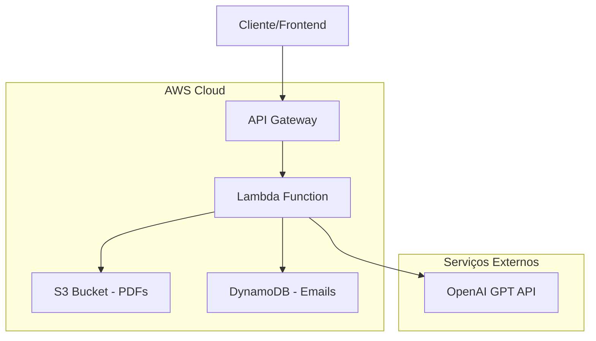

- q-developer-quest-tdc-2025

# Email Generator - Gerador de Emails Personalizados

Aplicação Node.js que gera emails personalizados usando PDFs como base de conhecimento e integração com OpenAI.

## Funcionalidades

- Lê PDFs automaticamente da pasta `src/data/pdfs`
- Consolida conteúdo dos PDFs como base de conhecimento
- Gera emails personalizados via OpenAI GPT
- API REST para integração
- Base de emails para personalização

## Estrutura do Projeto

```
prj-bcd/
├── package.json
├── src/
│   ├── index.js (servidor principal)
│   ├── services/
│   │   ├── pdfReader.js (lê PDFs)
│   │   ├── emailGenerator.js (gera emails)
│   │   └── knowledgeBase.js (gerencia base de conhecimento)
│   └── data/
│       ├── emails.json (base de emails)
│       └── pdfs/ (pasta para PDFs)
└── README.md
```

## Prompts Utilizados para Gerar o Projeto

### 1. Prompt inicial
```
me ajude a criar uma aplicação em node, que le uma base de emails, vai estar em uma pasta do projeto alguns pdfs que vão servir de base de conhecimento

o projeto deve ser uma aplicação que espera um prompt e vai ler essa base de conhecimento para gerar emails personalizados, pode me dar um esboço?
```

### 2. Prompt para documentação
```
agr no reame me ajude a criar algo explicando o projeto e quais comandos eu usei para gerar o código até agr
```

### 3. Prompt para adicionar prompts
```
no readme, adicione os prompts que usei para gerar esse projeto
```

## Comandos Utilizados para Gerar o Código

### 1. Estrutura inicial
```bash
mkdir -p src/services src/data src/data/pdfs
```

### 2. Instalação de dependências
```bash
npm install
```

### 3. Configuração do ambiente
```bash
cp .env.example .env
# Editar .env com OPENAI_API_KEY=sua_chave_aqui
```

## Como Usar

### 1. Instalar dependências
```bash
npm install
```

### 2. Configurar OpenAI
```bash
cp .env.example .env
# Adicionar sua chave da OpenAI no arquivo .env
```

### 3. Adicionar PDFs
Coloque seus arquivos PDF na pasta `src/data/pdfs/`

### 4. Executar aplicação
```bash
npm start
# ou para desenvolvimento:
npm run dev
```

## API Endpoints

### POST /generate-email
Gera email personalizado
```bash
curl -X POST http://localhost:3000/generate-email \
  -H "Content-Type: application/json" \
  -d '{"prompt": "Escreva um email de apresentação", "emailId": 1}'
```

### GET /emails
Lista base de emails disponíveis
```bash
curl http://localhost:3000/emails
```

### GET /reload-knowledge
Recarrega base de conhecimento dos PDFs
```bash
curl http://localhost:3000/reload-knowledge
```

## Dependências

- **express**: Servidor web
- **pdf-parse**: Extração de texto dos PDFs
- **openai**: Integração com OpenAI GPT
- **cors**: Habilitação de CORS

## Exemplo de Uso

1. Adicione PDFs com informações da empresa em `src/data/pdfs/`
2. Configure emails de destinatários em `src/data/emails.json`
3. Faça requisição POST para `/generate-email` com prompt personalizado
4. Receba email gerado baseado na base de conhecimento

## Arquitetura AWS Serverless

### Diagrama da Arquitetura



### Componentes da Arquitetura

#### 1. **API Gateway**
- Ponto de entrada para requisições HTTP
- Gerencia autenticação e rate limiting
- Integração direta com Lambda

#### 2. **Lambda Function**
- Executa lógica de negócio serverless
- Processa requisições de geração de email
- Integra com OpenAI para geração de conteúdo
- Acessa S3 para base de conhecimento
- Consulta DynamoDB para dados de emails

#### 3. **S3 Bucket**
- Armazena arquivos PDF da base de conhecimento
- Versionamento habilitado
- Acesso controlado via IAM

#### 4. **DynamoDB**
- Banco NoSQL para dados de emails
- Billing pay-per-request
- Alta disponibilidade

#### 5. **Integração OpenAI**
- API externa para geração de emails
- Modelo GPT-3.5-turbo
- Chave API armazenada como variável de ambiente

### Fluxo de Funcionamento

1. **Cliente** faz requisição POST para `/generate-email`
2. **API Gateway** recebe e encaminha para Lambda
3. **Lambda** extrai PDFs do S3 como base de conhecimento
4. **Lambda** busca dados do destinatário no DynamoDB
5. **Lambda** envia prompt + contexto para OpenAI
6. **OpenAI** retorna email personalizado
7. **Lambda** retorna resposta via API Gateway
8. **Cliente** recebe email gerado

## Deploy com Terraform

### 1. Configurar variáveis
```bash
cd terraform
cp terraform.tfvars.example terraform.tfvars
# Editar terraform.tfvars com suas configurações
```

### 2. Inicializar Terraform
```bash
terraform init
```

### 3. Planejar deploy
```bash
terraform plan
```

### 4. Aplicar infraestrutura
```bash
terraform apply
```

### 5. Upload de PDFs
```bash
aws s3 cp src/data/pdfs/ s3://BUCKET_NAME/ --recursive
```

## Variáveis de Ambiente

### Local
- `OPENAI_API_KEY`: Chave da API OpenAI (obrigatória)
- `PORT`: Porta do servidor (padrão: 3000)

### AWS Lambda
- `OPENAI_API_KEY`: Chave da API OpenAI
- `PDFS_BUCKET`: Nome do bucket S3
- `EMAILS_TABLE`: Nome da tabela DynamoDB

## Estimativa de Custos AWS

### Cenário: 1.000 emails/mês

| Serviço | Uso Mensal | Custo Estimado |
|---------|------------|----------------|
| **Lambda** | 1.000 invocações, 30s cada | $0.20 |
| **API Gateway** | 1.000 requests | $0.0035 |
| **S3** | 10 PDFs (50MB total) | $0.01 |
| **DynamoDB** | 1.000 reads | $0.25 |
| **OpenAI GPT-3.5** | 1.000 requests (~500k tokens) | $0.75 |
| **Total AWS** | | **$1.21/mês** |

### Cenário: 10.000 emails/mês

| Serviço | Uso Mensal | Custo Estimado |
|---------|------------|----------------|
| **Lambda** | 10.000 invocações, 30s cada | $2.00 |
| **API Gateway** | 10.000 requests | $0.035 |
| **S3** | 10 PDFs (50MB total) | $0.01 |
| **DynamoDB** | 10.000 reads | $2.50 |
| **OpenAI GPT-3.5** | 10.000 requests (~5M tokens) | $7.50 |
| **Total AWS** | | **$12.05/mês** |

### Fatores de Custo:
- **OpenAI**: Maior componente de custo (~60-70%)
- **DynamoDB**: Pay-per-request, escala com uso
- **Lambda**: Free tier: 1M requests/mês
- **S3**: Custo mínimo para armazenamento

### Otimizações de Custo:
1. **Cache de emails**: Reduzir chamadas OpenAI
2. **DynamoDB On-Demand**: Pagar apenas pelo uso
3. **Lambda Provisioned**: Para alto volume
4. **CloudWatch**: Monitorar custos em tempo real

> **Nota**: Use a [Calculadora AWS](https://calculator.aws) para estimativas precisas baseadas no seu uso específico.
